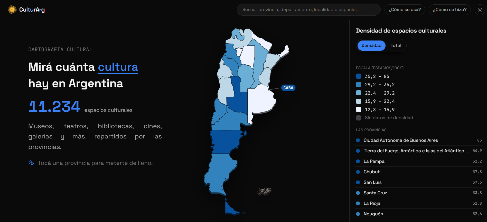
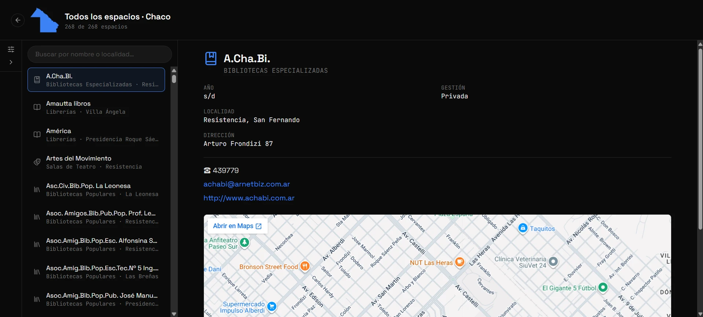

# CulturArg - Cartografía Cultural Argentina

**[culturaarg.vercel.app](https://culturaarg.vercel.app/)**

Mapa interactivo de los espacios culturales de Argentina: más de **11.000 espacios** (museos, teatros, bibliotecas, cines, centros culturales, galerías de arte, librerías, monumentos y sitios patrimoniales) cruzados con población por provincia y por departamento para mostrar su densidad real y su totalidad.

Proyecto presentado a la categoría **Exploración interactiva** del concurso ["Contar con Datos" 2026](https://datos.cultura.gob.ar), Ministerio de Cultura de la Nación.


<p align="center">
  
</p>

<p align="center">
  
</p>

---

## Qué se puede hacer

- **Explorar el mapa nacional** con dos capas intercambiables (Densidad, Total).
- **Entrar a una provincia**, ver su ficha resumen y sus destacados curados.
- **Abrir la vista completa de una provincia**: filtrar espacios por categoría y departamento, ver el choropleth de departamentos coloreado por densidad, y listar todos sus espacios.
- **Buscar** cualquier espacio o provincia desde el buscador global del header.
- **Leer "Cómo se hizo"**: la metodología, las fuentes y las limitaciones reales de los datos, contadas sin vueltas.
- Funciona en **mobile y desktop** con layouts distintos (hoja inferior deslizable en mobile, paneles laterales en desktop), tema claro/oscuro y respeta `prefers-reduced-motion`.

## Fuentes de datos

| Dato                                    | Fuente                                                                                                                      |
| --------------------------------------- | --------------------------------------------------------------------------------------------------------------------------- |
| Espacios culturales                     | [SInCA](https://datos.cultura.gob.ar) - Sistema de Información Cultural de la Argentina, Ministerio de Cultura de la Nación |
| Geometría de provincias y departamentos | [API Georef Argentina](https://apis.datos.gob.ar/georef/api/), Ministerio de Economía                                       |
| Población por provincia y departamento  | Censo Nacional de Población, Hogares y Viviendas 2022 (INDEC)                                                               |

Todo el detalle de cómo se cruzan y qué limitaciones tienen está en [`docs/data-quality-report.md`](docs/data-quality-report.md) y en la sección "Cómo se hizo" de la app (`src/features/about/ComoSeHizo.tsx`).

## Stack técnico

- **Vite + React 19 + TypeScript**
- **Tailwind CSS 4**
- **Mapa**: SVG puro con `d3-geo` (proyección Mercator fiteada al viewport) y `d3-scale` para las escalas de color.
- **Estado global**: Zustand
- **Listas largas**: `react-window` (virtualización del listado de espacios)
- **Animaciones**: Motion (Framer Motion) para paneles y transiciones; el mapa usa transiciones CSS nativas en sus `<path>` por ser más liviano
- **Testing**: Vitest + Testing Library (397 tests sobre lógica de datos, hooks y componentes)
- **Pipeline de datos**: scripts Node (`@turf/simplify`, `xlsx`, `sharp`).

## Cómo correr el proyecto

```bash
npm install
npm run dev
```

Otros comandos disponibles:

```bash
npm run build          # type-check + build de producción
npm run test           # corre la suite de Vitest
npm run lint           # ESLint
npm run format:check   # Prettier en modo chequeo
npm run typecheck      # tsc sin emitir
```

## Estructura del proyecto

```
src/
  components/       componentes compartidos (Header, ThemeToggle, ErrorBoundary, ...)
  data/             hooks y tipos para consumir los JSON ya procesados
  data/espacios/    un JSON por provincia con sus espacios culturales
  data/departamentos/  un JSON por provincia con sus departamentos/comunas
  features/
    map/            mapa nacional, capas, leyenda, tooltip, intro
    province-panel/ ficha de provincia, destacados, vista completa, filtros
    search/         buscador global
    about/          modal de info, "Cómo se hizo", buzón de sugerencias
  store/            estado global (Zustand)
  utils/            hooks utilitarios (historial de paneles, media queries, ...)
scripts/            pipeline de datos
data/               población por provincia/departamento y CSVs crudos (data/raw)
docs/               reporte de calidad de datos
```

## Pipeline de datos

Los datos ya procesados viven en `src/data/`, así que **no hace falta correr nada para levantar el proyecto**. Para regenerarlos desde las fuentes originales:

```bash
node scripts/fetch-data.mjs               # descarga CSVs (SInCA) y GeoJSON (Georef) a /data/raw
node scripts/fetch-poblacion-departamentos.mjs  # población por departamento (INDEC)
node scripts/process-data.mjs             # normaliza, cruza geometría/población y emite src/data/*.json
```

Si el entorno no tiene salida de red a `datos.cultura.gob.ar`, `fetch-data.mjs` pide que se coloquen los CSV manualmente en `/data/raw/`.

`process-data.mjs` hace, entre otras cosas:

- Normaliza las ~11 categorías de CSV de SInCA a un esquema común.
- Deriva `provinciaId` y `departamentoId` del código de localidad INDEC (no de la columna de provincia en texto, que trae errores de tipeo puntuales).
- Resuelve las comunas de CABA por geocodificación point-in-polygon, ya que SInCA no las distingue (todas traen el código placeholder de la ciudad entera).
- Simplifica la geometría de provincias y departamentos con `@turf/simplify`.
- Calcula densidad de espacios cada 100 mil habitantes por provincia y por departamento.
- Genera `docs/data-quality-report.md` con el chequeo de completitud de cada categoría.

Otros scripts (`comprimir-fotos-destacados.mjs`, `optimize-fotos-destacados.mjs`, `generar-og-image.mjs`, `extract-malvinas.mjs`) resuelven pasos puntuales de assets e imágenes; no forman parte del pipeline de datos principal.

## Limitaciones conocidas

Documentadas con más detalle en [`NOTES.md`](NOTES.md) y en "Cómo se hizo" dentro de la app:

- ~200 de ~11.000 espacios tienen coordenadas que no caen dentro de la provincia que el propio registro declara (error de geocodificación de la fuente, no del mapa).
- El 58% de los registros no tiene año de inauguración documentado (varía mucho por categoría).
- 28 espacios de CABA quedan sin comuna resuelta (sin coordenadas confiables o fuera de los límites de las 15 comunas reales).
